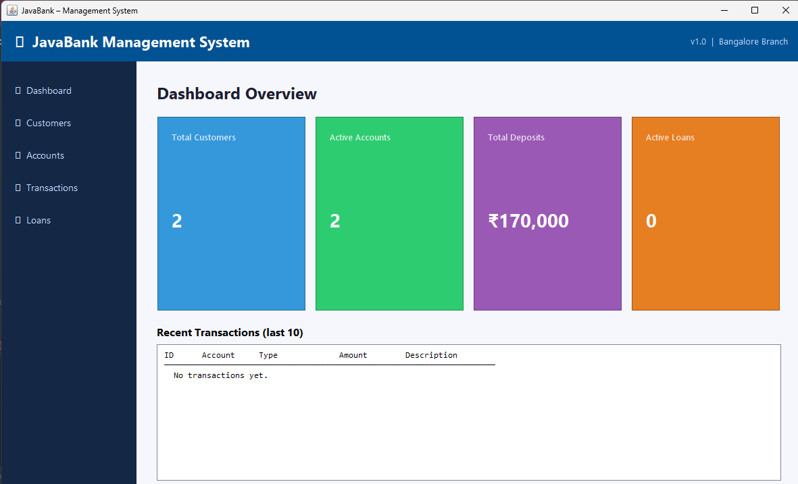
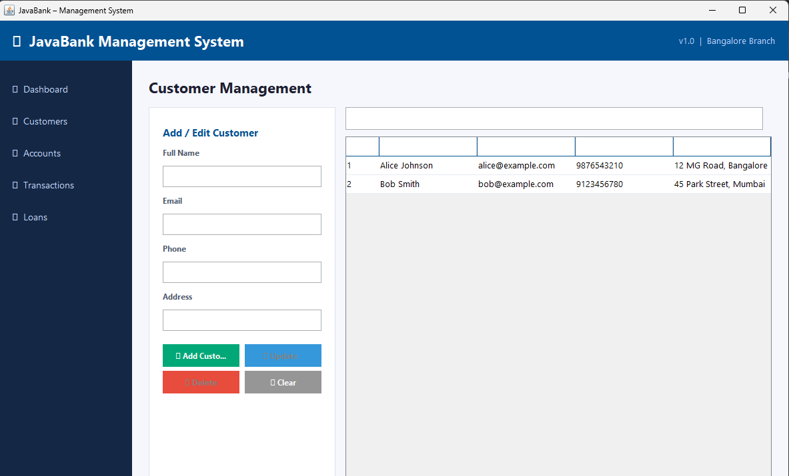
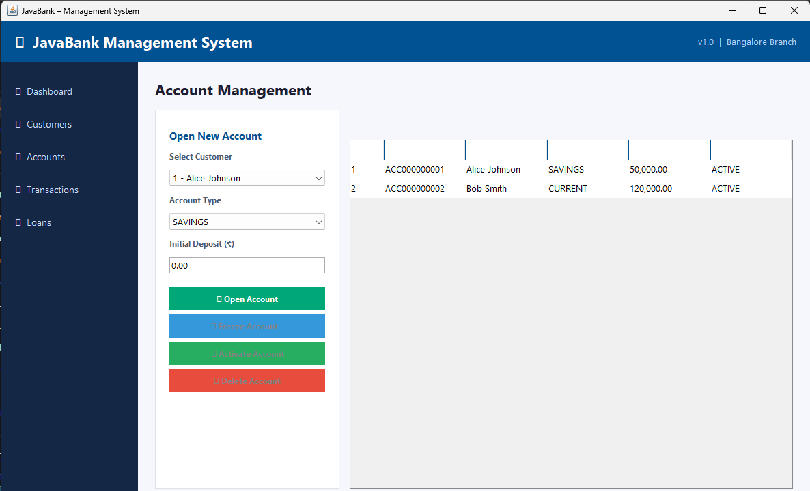

<<<<<<< HEAD
<div align="center">

# 🏦 JavaBank Management System

**A full-featured Java desktop banking application**

[](https://github.com/jeevajeevak/bank-management-system/actions)
[](https://github.com/YOUR_USERNAME/bank-management-system/releases/latest)
[](https://adoptium.net)
[](https://www.mysql.com)
[](LICENSE)

</div>

---

## ✨ Features

| Module | Capabilities |
|--------|-------------|
| 📊 **Dashboard** | Live stats — total customers, accounts, deposits, active loans + recent transactions |
| 👤 **Customers** | Add / Edit / Delete / Search customers |
| 💳 **Accounts** | Open Savings, Current, Fixed Deposit accounts · Freeze / Activate / Close |
| 💸 **Transactions** | Deposit · Withdrawal · Fund Transfer · Full transaction history |
| 🏠 **Loans** | Apply · Approve / Reject · Pay EMI · Live EMI calculator |

---

## 🖥️ Screenshots

> Dashboard → Customers → Accounts → Transactions → Loans

```
┌─────────────────────────────────────────────────────────────┐
│ 🏦  JavaBank Management System          v1.0  Bangalore     │
├──────────────┬──────────────────────────────────────────────┤
│ 📊 Dashboard │   Dashboard Overview                         │
│ 👤 Customers │                                              │
│ 💳 Accounts  │  [Customers: 24] [Accounts: 31] [₹12.4L]   │
│ 💸 Transactions  [Active Loans: 6]                         │
│ 🏠 Loans     │                                              │
│              │  Recent Transactions ────────────────────    │
└──────────────┴──────────────────────────────────────────────┘
```

---

## 🚀 Quick Start

### Option A — Download EXE (Windows, easiest)

1. Go to [**Releases**](https://github.com/jeevajeevak/bank-management-system/releases/latest)
2. Download `JavaBank-x.x.x.exe`
3. Run `sql/schema.sql` in MySQL first
4. Double-click the EXE — done!

### Option B — Run JAR (any OS)

```bash
# Prerequisites: Java 11+, MySQL running, schema.sql executed

# Set your MySQL password
export DB_PASSWORD=your_mysql_password    # Linux/Mac
set DB_PASSWORD=your_mysql_password       # Windows CMD

# Run
java -jar JavaBank.jar
```

### Option C — Build from source

```bash
git clone https://github.com/jeevajeevak/bank-management-system.git
cd bank-management-system

# 1. Set up database
mysql -u root -p < sql/schema.sql

# 2. Set password in DBConnection.java (line with DEFAULT_PASSWORD)
#    or set env variable: export DB_PASSWORD=yourpassword

# 3. Build & run with Maven
mvn package
java -jar target/JavaBank.jar
```

---

## 🛠️ Tech Stack

| Layer | Technology |
|-------|-----------|
| Language | Java 11 |
| GUI | Java Swing |
| Database | MySQL 5.7+ |
| DB Driver | MySQL Connector/J 8.3 |
| Build | Apache Maven |
| Packaging | jpackage (Java 17+) |
| CI/CD | GitHub Actions |

---

## 🏗️ Architecture

```
bank/
├── Main.java                    ← Entry point
│
├── model/                       ← Data layer (POJOs)
│   ├── Customer.java
│   ├── Account.java             ← Enums: SAVINGS / CURRENT / FIXED_DEPOSIT
│   ├── Transaction.java         ← Enums: DEPOSIT / WITHDRAWAL / TRANSFER
│   └── Loan.java                ← EMI formula, LoanStatus enum
│
├── dao/                         ← Database Access Objects (SQL queries)
│   ├── CustomerDAO.java
│   ├── AccountDAO.java
│   ├── TransactionDAO.java
│   └── LoanDAO.java
│
├── service/                     ← Business logic & validation
│   └── BankService.java         ← Rules: "can't withdraw more than balance"
│
├── ui/                          ← Swing GUI panels
│   ├── MainFrame.java           ← Root window, sidebar nav, CardLayout
│   ├── DashboardPanel.java
│   ├── CustomerPanel.java
│   ├── AccountPanel.java
│   ├── TransactionPanel.java
│   └── LoanPanel.java
│
└── util/
    └── DBConnection.java        ← Singleton DB connection (env var support)
```

**Pattern:** `UI → BankService → DAO → MySQL`  
This is the industry-standard **MVC + DAO** pattern used in enterprise Java.

---

## ⚙️ Configuration

### Using Environment Variables (recommended)

| Variable | Default | Description |
|----------|---------|-------------|
| `DB_HOST` | `localhost` | MySQL host |
| `DB_PORT` | `3306` | MySQL port |
| `DB_USER` | `root` | MySQL username |
| `DB_PASSWORD` | *(empty)* | **MySQL password** ← set this |

### Using the Setup Wizard

```
setup/START_SETUP.bat    ← Windows
setup/START_SETUP.sh     ← Linux / Mac
```

The wizard GUI lets you enter credentials and browse for the JDBC JAR, then compiles and launches the app automatically.

---

## 📦 Building the EXE yourself

The GitHub Actions workflow (`.github/workflows/build-and-release.yml`) automatically creates a Windows EXE whenever you push a version tag:

```bash
git tag v1.0.0
git push origin v1.0.0
```

GitHub will build the EXE on a Windows server and attach it to the release — no Windows machine needed!

To build locally on Windows:
```powershell
mvn package
jpackage --input target --name JavaBank --main-jar JavaBank.jar `
         --main-class bank.Main --type exe --dest dist `
         --win-shortcut --win-menu
```

---

## 🗄️ Database Schema

```sql
customers    → customer_id, full_name, email, phone, address
accounts     → account_id, account_number, customer_id, type, balance, status
transactions → transaction_id, account_id, type, amount, description, date
loans        → loan_id, customer_id, type, principal, rate, duration, emi, paid, status
```

Run `sql/schema.sql` to create all tables and load sample data.

---

## 🧠 Java Concepts Demonstrated

| Concept | Location |
|---------|----------|
| OOP — Encapsulation, Enums | All model classes |
| Design Patterns — MVC, DAO, Singleton | Full project |
| JDBC + PreparedStatement (SQL injection safe) | All DAO classes |
| Java Swing — JFrame, JTable, JComboBox, CardLayout | All UI classes |
| Stream API + Lambdas | DashboardPanel |
| Exception handling | DBConnection, all DAOs |
| Environment variable config | DBConnection |
| Maven build system | pom.xml |
| GitHub Actions CI/CD | .github/workflows/ |

---

## 📄 License

This project is licensed under the [MIT License](LICENSE).

---

<div align="center">
Built with ☕ Java · Made for learning & resume building
</div>
=======
# bank-management-system
>>>>>>> c210d759213d45e5fd7dba8e75fa52b6e8cb13fc
